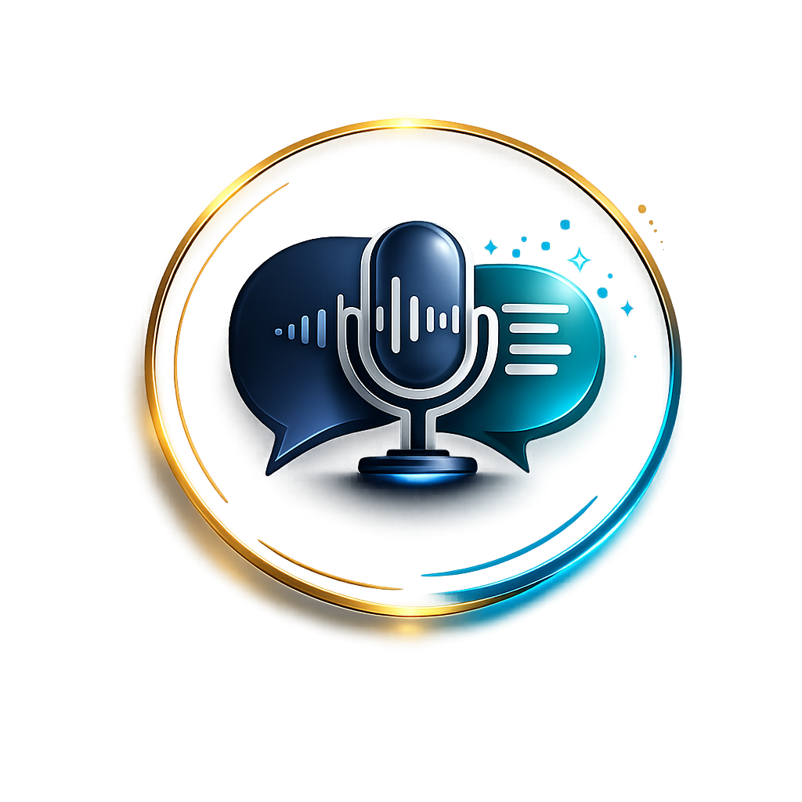

<p align="center">
  
</p>

<h1 align="center">KeyScribe</h1>

<p align="center">
  Fast dictation for macOS — types directly into your active app.<br/>
  Local-first, AI-enhanced, open source.
</p>

<p align="center">
  <a href="https://github.com/manikv12/KeyScribe/releases"></a>
  
  
  
</p>

---

## What is KeyScribe?

KeyScribe is a macOS menu-bar app that transcribes your voice and types the result directly into whatever app you're using — no copy-pasting, no switching windows.

Press a shortcut, speak, and your words appear. That's it.

It runs entirely as a menu-bar utility (no Dock icon). Everything is stored locally on your Mac — no account, no sign-in, no telemetry.

---

## User Guide

For a full step-by-step walkthrough (setup, permissions, daily workflows, AI features, updates, and troubleshooting), see:

- [KeyScribe User Guide](Docs/User-Guide.md)

---

## Features

### 🎙️ Transcription

- **Apple Speech** — works out of the box, local-first by default using `SFSpeechRecognizer`
- **Whisper.cpp** — fully on-device using downloaded model files (`tiny.en`, `base.en`, `small.en`). No network dependency once the model is installed.
- Automatic text cleanup: spacing, punctuation, capitalization, duplicate-word removal
- Transcript history: last 20 entries stored locally
- Paste last transcript instantly with `⌥⌘V`

### ✨ AI Rewrite (optional)

Optionally refine your dictated text using an AI model before it's inserted. Supports:

| Provider | Notes |
|---|---|
| **Ollama (Local)** | Fully on-device, no API key needed — one-click setup built in |
| **OpenAI** | API key or OAuth |
| **Anthropic (Claude)** | API key |
| **Google Gemini** | API key |
| **Groq** | API key |
| **OpenRouter** | API key |

Rewrite strength is adjustable: `Light`, `Balanced`, or `Strong`.

### 🧠 Conversation Context

KeyScribe tracks conversation history per app and thread so AI rewrites stay coherent with what you've already said — even across pauses and multiple dictation bursts.

- Infers project, identity, and thread automatically from screen context
- Maintains per-app history with configurable timeout and turn limits
- Cross-IDE context linking (e.g. your editor and your AI assistant treated as one session)

### 🗂️ AI Memory Studio

A built-in dashboard (accessible from Settings → AI Models → Open AI Studio) to:

- View conversation thread history and pattern stats
- Manage context mappings across apps
- Inspect how conversation context is resolved per app and thread

> **Note:** Memory indexing (reading local AI tool files from Claude, Cursor, Copilot, etc.) is implemented but currently disabled by default as a feature flag. Conversation tracking and AI rewrite are fully active.

---

## Shortcuts

| Action | Default shortcut |
|---|---|
| Hold-to-talk (burst dictation) | `⌥⌘Space` |
| Toggle continuous dictation | `⌃⌥⌘Space` |
| Paste last transcript | `⌥⌘V` |

All shortcuts are customizable in Settings.

---

## Local AI Setup (no API key needed)

KeyScribe includes a zero-terminal setup for local AI — no API key, no account, no command line.

1. Open **Settings → AI Models → Open AI Studio**
2. Go to **Prompt Models**
3. Under **Local AI Setup**, pick a model and click **Install Selected Model**
4. Wait for the wizard to complete: `Select` → `Install Runtime` → `Download` → `Verify` → `Done`

KeyScribe auto-configures Ollama with your chosen model. AI rewrite and conversation tracking are enabled automatically.

**Recovery:** If local AI becomes unavailable, open AI Studio → Prompt Models → **Repair Local AI**.

---

## How text insertion works

1. If Accessibility insertion is explicitly enabled: attempts direct AX text insert
2. If clipboard copy mode is **ON**: writes to clipboard, sends paste shortcut, falls back to typed unicode events
3. If clipboard copy mode is **OFF** (default): uses transient clipboard — pastes, then restores your prior clipboard contents

The default mode keeps dictation text out of persistent clipboard managers.

---

## Privacy

- No account required
- No telemetry or analytics
- All data (transcripts, conversation history, settings) stored locally on your Mac
- Clipboard copy mode is OFF by default — dictation does not pollute clipboard history
- No content is sent anywhere without your explicit AI provider configuration

---

## Requirements

- macOS 13.3 or later
- **Microphone** and **Accessibility** permissions required
- **Speech Recognition** permission required only when using Apple Speech engine

---

## Build & Install

```bash
./build.sh
```

Builds `dist/KeyScribe.app` and `dist/KeyScribe.dmg` (drag-and-drop installer). Whisper XCFramework is fetched automatically if missing.

```bash
./build.sh --install     # build + install to /Applications
./build.sh --no-dmg      # skip DMG generation
```

**Public distribution (notarized):**

```bash
export DEVELOPER_ID="Your Name (TEAMID)"
./build.sh
Scripts/notarize.sh
```

---

## Project Structure

```
Sources/KeyScribe/
├── App.swift                          # App lifecycle, menu bar, permission flow
├── Services/
│   ├── SpeechTranscriber.swift        # Transcription engine router
│   ├── AppleSpeechTranscriber.swift   # Apple Speech pipeline
│   ├── WhisperTranscriber.swift       # Whisper.cpp pipeline
│   ├── WhisperModelCatalog.swift      # Curated model metadata
│   ├── WhisperModelManager.swift      # Model download/install/delete
│   ├── TextInserter.swift             # Insertion engine + fallbacks
│   ├── HotkeyManager.swift            # Hold-to-talk and toggle hotkeys
│   ├── TranscriptHistoryStore.swift   # Local transcript history
│   ├── PromptRewriteService.swift     # AI rewrite orchestration
│   ├── PromptRewriteConversationStore.swift  # Conversation history
│   ├── ConversationContextResolverV2.swift   # Context + thread resolution
│   ├── ConversationTagInferenceService.swift # Project/identity inference
│   └── Memory/
│       ├── MemoryIndexingService.swift        # Memory scan + indexing
│       ├── MemorySQLiteStore.swift            # Local SQLite persistence
│       ├── ConversationAgentStateService.swift # Per-thread agent state
│       └── MemoryModels.swift                 # Data models
└── Views/
    ├── AIMemoryStudioView.swift        # Memory + conversation dashboard
    ├── PromptRewriteHUD.swift          # Rewrite preview HUD
    └── StatusBarPopoverView.swift      # Menu bar popover
```

---

## Diagnostics

Enable insertion diagnostics for debugging:

- **Settings → General → Enable insertion diagnostics**
- Or set `KEYSCRIBE_INSERTION_DIAGNOSTICS=1`
- Log output: `/tmp/keyscribe-insertion-diagnostics.log`

Run test suite:

```bash
Scripts/run-tests.sh
Scripts/run-insertion-reliability.sh --regression
```

---

## Reset permissions (dev/testing)

```bash
sudo tccutil reset Accessibility com.keyscribe.KeyScribe
```
